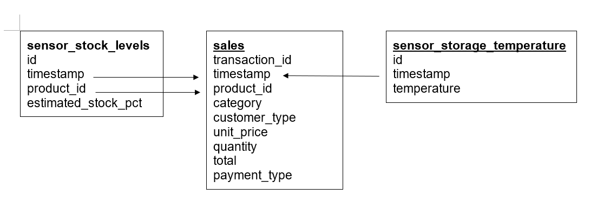
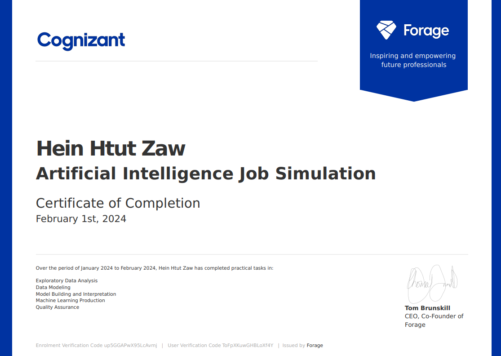

# COGNIZANT FORAGE AI JOB SIMULATION

## Problem Statement

Gala Groceries approached Cognizant to help them with a supply chain issue. Groceries are highly perishable items. If you overstock, you are wasting money on excessive storage and waste, but if you understock, then you risk losing customers. They want to know how to better stock the items that they sell.

“Can we accurately predict the stock levels of products, based on sales data and sensor data, 
on an hourly basis in order to more intelligently procure products from our suppliers.”

## Set Up

* First create a virtual environment to avoid conflicts between existing libraries.

```bash
python3 -m venv myenv
```
For MacOS:
```bash
source myenv/bin/activate
```
For Windows:
```bash
myenv\Scripts\activate
```
Upgrade pip & install required packages
```bash
python3 -m pip install --upgrade pip
pip install -r requirements.txt
```

## Exploratory Data Analysis

In `eda.ipynb`, Data Cleaning, Visualization, Statistical Analysis can be seen.


## Data Modelling



* This data model diagram shows 3 tables:
    * sales = sales data
    * sensor_storage_temperature = IoT data from the temperature sensors in the storage facility for the products
    * sensor_stock_levels = estimated stock levels of products based on IoT sensors

These tables are merged by the linked columns indicated by the arrows.


## Predictive Modelling

 In `modeling.ipynb`, Keras's `RandomForestRegressor` is used for predictive modeling.
 In `model.py`, TensorFlow library is used to create small neural network which reduces the `MAE` from 0.24 to 0.22.

## Reference


